# Distribuidora de Gaseosas del Valle  - Sistema de Gestión Relacional

## Descripción del Proyecto
Este proyecto consiste en el diseño, desarrollo e implementación de una base de datos relacional estructurada en MySQL para **Distribuidora de Gaseosas del Valle**. El sistema está diseñado para optimizar el control de inventario de bebidas en múltiples sedes, gestionar la información de los clientes, y procesar la facturación mediante pedidos y detalles de pedido. 

El modelo implementa lógica de negocios directamente en la base de datos a través de **vistas, funciones almacenadas y triggers**, garantizando la integridad referencial, automatización de cálculos (como el IVA y descuentos de stock) y la auditoría estricta sobre la fluctuación de los precios de los productos.

**Camper:** Marco Antonio Canux Raquec - Campuslands Guatemala.

---

## Modelo Entidad–Relación
A continuación se presenta los diagramas lógico y físico de la base de datos, estructurado bajo reglas de normalización para evitar redundancias.

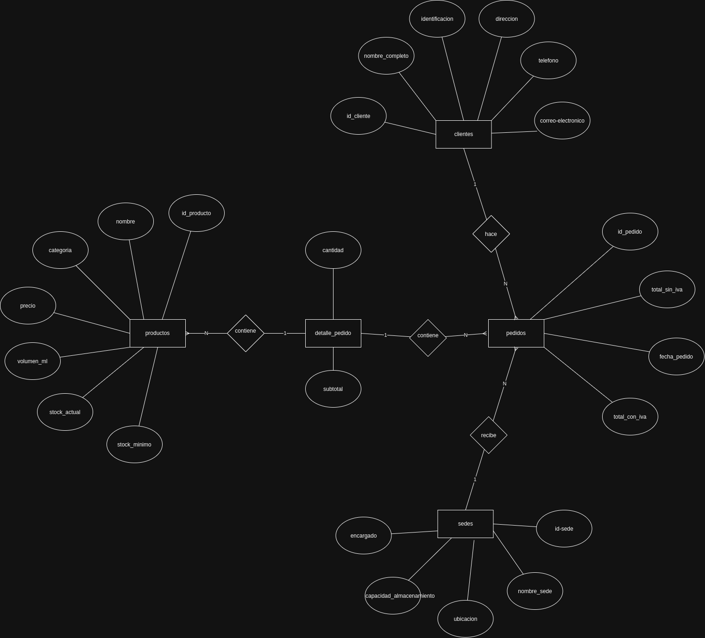
*(Nota: Captura generada desde draw.io)*

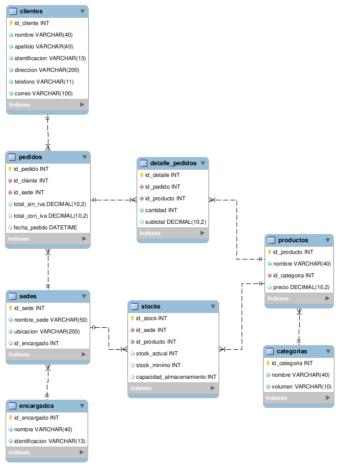
*(Nota: Captura generada desde MySQL Workbench)*

---

## Funciones Almacenadas (CREATE FUNCTION)

### 1. `fn_calcular_total_con_iva`
*   **Propósito:** Calcula automáticamente el total a pagar de un pedido aplicando el 12% de IVA.
*   **Mecánica:** Recibe como parámetro el `id_pedido`, consulta la tabla de `detalle_pedidos` para sumar los subtotales asociados a ese pedido, multiplica el resultado por 1.12 y retorna el monto final.

### 2. `fn_validar_stock`
*   **Propósito:** Actúa como un mecanismo de prevención antes de procesar una venta.
*   **Mecánica:** Recibe el `id_producto` y la `cantidad` solicitada. Consulta la tabla `stocks` y retorna un de texto indicando si existe suficiente inventario para cubrir la demanda antes de confirmar el bloque del pedido.

---

## Triggers / Disparadores (CREATE TRIGGER)

### 1. `tr_actualizar_stock`
*   **Propósito:** Automatizar el control de inventarios sin depender del código backend de la aplicación.
*   **Mecánica:** Se ejecuta `AFTER INSERT` sobre la tabla `detalle_pedidos`. Inmediatamente después de que un artículo se agrega a un pedido, este trigger descuenta la `cantidad` vendida del `stock_actual` en la tabla `stocks`.

### 2. `tr_auditar_cambio_precio`
*   **Propósito:** Mantener un historial de seguridad sobre el valor económico del catálogo.
*   **Mecánica:** Se dispara `AFTER UPDATE` en la tabla `productos`. Si el valor de la columna `precio` es modificado, registra en la tabla `auditoria_precios` el ID del producto, el precio anterior (`OLD.precio`), el precio nuevo (`NEW.precio`) y la fecha exacta del cambio.

---

## Vistas (CREATE VIEW)

### 1. `vw_resumen_pedidos_por_sede`
*   **Descripción:** Genera un reporte consolidado agrupando la cantidad total de pedidos procesados y la suma de ingresos de ventas, segmentado por cada sucursal.

*   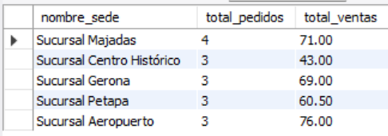

### 2. `vw_productos_bajo_stock`
*   **Descripción:** Un panel de alerta de reabastecimiento. Muestra exclusivamente aquellos productos cuyo `stock_actual` ha caído a niveles iguales o menores que su `stock_minimo`.

*   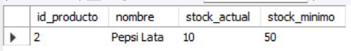

### 3. `vw_clientes_activos`
*   **Descripción:** Filtra el catálogo general de clientes para mostrar únicamente a aquellos que han realizado al menos un pedido, cruzando datos mediante `INNER JOIN` e incluyendo el conteo total de sus transacciones.

*   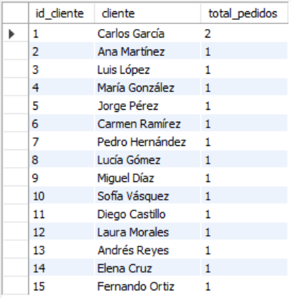

---

## Consultas SQL (Queries)

En la carpeta del proyecto se han probado con éxito las siguientes operaciones transaccionales y reportes:

**1. Consultar los productos con stock por debajo del mínimo.**

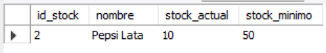

**2. Consultar los pedidos realizados entre dos fechas (BETWEEN).**

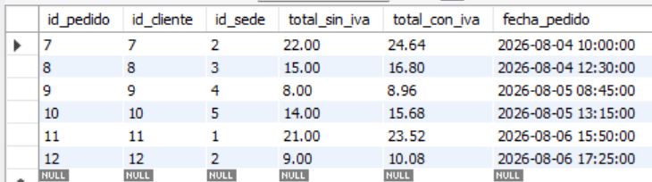

**3. Listar los productos más vendidos (con JOIN y GROUP BY).**

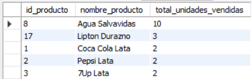

**4. Mostrar clientes y la cantidad de pedidos realizados.**

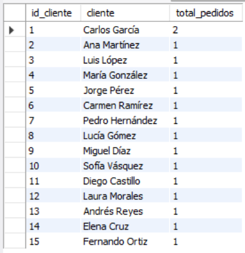

**5. Buscar clientes por nombre parcial usando LIKE.**

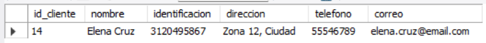

**6. Consultar productos de ciertas categorías usando IN.**

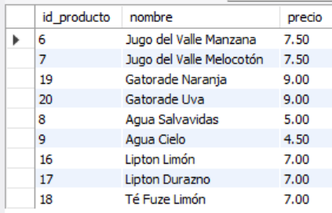

**7. Mostrar el cliente con mayor número de pedidos (subconsulta).**

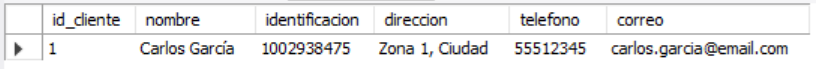

**8. Consultar pedidos y sus totales agrupados por sede.**

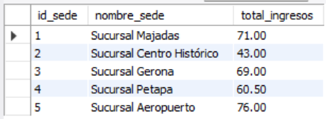

---
